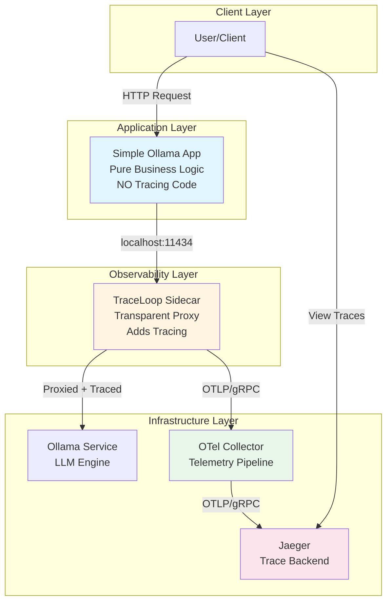
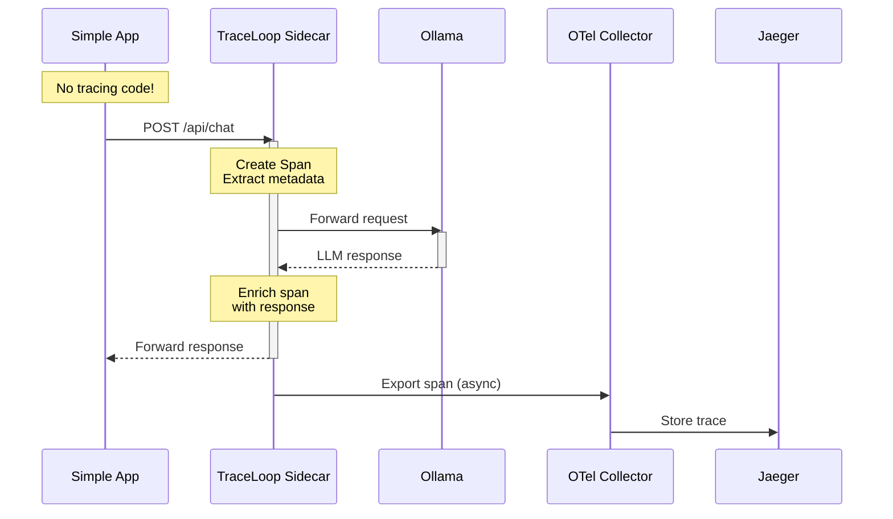

# Architecture Documentation

> **📖 For deployment instructions with step-by-step guides, see [DEPLOYMENT.md](DEPLOYMENT.md)**

## System Overview

The OpenLLMetry SideCar project demonstrates the **sidecar pattern** for adding distributed tracing to LLM applications. The key innovation is complete separation between application logic and observability infrastructure - applications require **zero tracing code**.

### High-Level Architecture



## Core Principle: Separation of Concerns

```
Application Code:        Observability Infrastructure:
┌──────────────┐        ┌──────────────────┐
│ Business     │        │ TraceLoop        │
│ Logic Only   │───────▶│ Sidecar          │
│              │        │ (Tracing Proxy)  │
└──────────────┘        └────────┬─────────┘
                                 │
                                 ▼
                        ┌──────────────────┐
                        │ OTel Collector   │
                        └────────┬─────────┘
                                 │
                                 ▼
                        ┌──────────────────┐
                        │ Jaeger (Storage) │
                        └──────────────────┘
```

## Component Architecture

### Detailed Flow Diagram

```
┌─────────────────────────────────────────────────────────────────────┐
│                    Kubernetes Pod / Docker Network                   │
│                                                                      │
│  ┌────────────────────────────────────────────────────────────┐    │
│  │                    Application Container                    │    │
│  │                                                             │    │
│  │  ┌──────────────────────────────────────────────────┐     │    │
│  │  │  Simple Ollama App (Flask)                       │     │    │
│  │  │  - Pure business logic                           │     │    │
│  │  │  - No OpenTelemetry imports                      │     │    │
│  │  │  - No tracing code                               │     │    │
│  │  │  - OLLAMA_HOST=http://localhost:11434           │     │    │
│  │  └──────────────────────┬───────────────────────────┘     │    │
│  │                         │ HTTP Request                     │    │
│  │                         │ POST /api/chat                   │    │
│  │                         ▼                                  │    │
│  │  ┌──────────────────────────────────────────────────┐     │    │
│  │  │  TraceLoop Sidecar (Flask Proxy)                 │     │    │
│  │  │  - Listens on localhost:11434                    │     │    │
│  │  │  - Intercepts all Ollama traffic                 │     │    │
│  │  │  - Creates OpenTelemetry spans                   │     │    │
│  │  │  - Extracts LLM metadata                         │     │    │
│  │  │  - Forwards to upstream Ollama                   │     │    │
│  │  └──────────────────────┬───────────────────────────┘     │    │
│  └─────────────────────────┼──────────────────────────────────┘    │
│                            │                                        │
└────────────────────────────┼────────────────────────────────────────┘
                             │ HTTP Request (proxied)
                             │ + OpenTelemetry Context
                             ▼
                    ┌──────────────────┐
                    │  Ollama Service  │
                    │  (Port 11434)    │
                    │                  │
                    │  - Granite3 LLM  │
                    │  - Model serving │
                    └────────┬─────────┘
                             │ Response
                             ▼
                    ┌──────────────────┐
                    │  TraceLoop       │
                    │  Sidecar         │
                    │  - Adds response │
                    │    to span       │
                    │  - Exports trace │
                    └────────┬─────────┘
                             │ OTLP/gRPC
                             │ (Port 4317)
                             ▼
                    ┌──────────────────┐
                    │ OTel Collector   │
                    │                  │
                    │ - Receives       │
                    │ - Processes      │
                    │ - Batches        │
                    └────────┬─────────┘
                             │ OTLP/gRPC
                             ▼
                    ┌──────────────────┐
                    │     Jaeger       │
                    │                  │
                    │ - Stores traces  │
                    │ - Query API      │
                    │ - Web UI         │
                    └──────────────────┘
```

## Component Details

### 1. Simple Ollama Application

**Purpose**: Business logic without observability concerns

**Technology**: Python 3.11 + Flask

**Key Characteristics**:
- ✅ **NO OpenTelemetry imports**
- ✅ **NO tracing code**
- ✅ **NO instrumentation**
- ✅ Pure business logic

**Dependencies** ([`ollama-simple-app/requirements.txt`](ollama-simple-app/requirements.txt)):
```
flask==3.0.0
ollama==0.4.4
werkzeug==3.0.1
```

**Configuration**:
- `OLLAMA_HOST`: Points to sidecar (`http://localhost:11434`)
- `OLLAMA_MODEL`: Model to use
- `PORT`: Flask server port (8080)

**API Endpoints**:
- `GET /health`: Health check
- `POST /chat`: Single chat request
- `POST /batch`: Batch chat requests

**Resources**:
- Memory: 256-512MB
- CPU: 100-500m

### 2. TraceLoop Sidecar

**Purpose**: Transparent tracing proxy for Ollama traffic

**Technology**: Python 3.11 + Flask + OpenTelemetry

**Key Features**:
1. **HTTP Proxy**: Intercepts all traffic to Ollama
2. **Span Creation**: Creates OpenTelemetry spans for each request
3. **Metadata Extraction**: Parses requests/responses for LLM data
4. **Attribute Enrichment**: Adds LLM-specific span attributes
5. **Trace Export**: Sends traces to OpenTelemetry Collector

**Dependencies** ([`traceloop-sidecar/requirements.txt`](traceloop-sidecar/requirements.txt)):
```
flask==3.0.0
requests==2.31.0
opentelemetry-api==1.27.0
opentelemetry-sdk==1.27.0
opentelemetry-exporter-otlp-proto-grpc==1.27.0
```

**Supported Operations**:
- `/api/chat`: Chat completions
- `/api/generate`: Text generation
- `/api/pull`: Model downloads
- `/api/tags`: List models

**Span Attributes Added**:
| Attribute | Description | Example |
|-----------|-------------|---------|
| `llm.system` | LLM platform | `ollama` |
| `llm.model` | Model identifier | `granite3:latest` |
| `llm.operation` | Operation type | `chat`, `generate` |
| `llm.prompt` | User input | `What is...` |
| `llm.response` | Model output | `OpenTelemetry is...` |
| `llm.response_length` | Response size | `245` |
| `http.method` | HTTP method | `POST` |
| `http.url` | Full URL | `http://ollama:11434/api/chat` |
| `http.status_code` | Status | `200` |
| `http.response_time_ms` | Duration | `1234.56` |
| `service.name` | Service | `ollama-simple-app` |

**Configuration**:
- `OLLAMA_UPSTREAM`: Real Ollama endpoint
- `OTEL_EXPORTER_OTLP_ENDPOINT`: Collector endpoint
- `OTEL_SERVICE_NAME`: Sidecar identifier
- `TRACED_SERVICE_NAME`: Application identifier
- `PORT`: Proxy listen port (11434)

**Resources**:
- Memory: 128-256MB
- CPU: 50-200m

### 3. Ollama Service

**Purpose**: LLM inference engine

**Technology**: Ollama (Go-based)

**Key Features**:
- Model loading and serving
- REST API for inference
- Memory-efficient model management

**Ports**:
- 11434: HTTP API

**Resources**:
- Memory: 2-4GB (model-dependent)
- CPU: 1-2 cores

### 4. OpenTelemetry Collector

**Purpose**: Telemetry data pipeline

**Technology**: OpenTelemetry Collector Contrib

**Pipeline**:
```
Receivers → Processors → Exporters
```

**Configuration** ([`collector/otel-collector-config.yaml`](collector/otel-collector-config.yaml)):

**Receivers**:
- OTLP gRPC (4317)
- OTLP HTTP (4318)

**Processors**:
- `batch`: Batches spans for efficiency
- `memory_limiter`: Prevents OOM
- `resource`: Adds resource attributes

**Exporters**:
- `logging`: Console output (debugging)
- `otlp`: Forwards to Jaeger

**Resources**:
- Memory: 256-512MB
- CPU: 100-500m

### 5. Jaeger

**Purpose**: Trace storage and visualization

**Technology**: Jaeger All-in-One

**Features**:
- OTLP-native ingestion
- Web UI for trace exploration
- In-memory storage (demo)

**Ports**:
- 4317: OTLP gRPC
- 16686: Web UI
- 14250: Jaeger gRPC

**Resources**:
- Memory: 256-512MB
- CPU: 100-500m

## Data Flow

### Request Flow with Tracing

```
1. Application Code:
   client.chat(model="granite3", messages=[...])
   
2. HTTP Request:
   POST http://localhost:11434/api/chat
   
3. Sidecar Intercepts:
   - Creates span: "ollama.post.api/chat"
   - Parses request body
   - Extracts: model, messages
   
4. Sidecar Forwards:
   POST http://ollama:11434/api/chat
   (with same body)
   
5. Ollama Processes:
   - Loads model
   - Generates response
   - Returns JSON
   
6. Sidecar Receives Response:
   - Parses response body
   - Extracts: response text
   - Adds to span attributes
   - Calculates duration
   
7. Sidecar Returns to App:
   - Forwards response unchanged
   - App receives normal response
   
8. Span Export:
   - Sidecar exports span to Collector
   - Collector processes and forwards to Jaeger
   - Trace appears in Jaeger UI
```

### Trace Context Propagation

```
Application Request
       ↓
Sidecar creates Trace ID + Span ID
       ↓
Span attributes added:
  - llm.model
  - llm.prompt
  - llm.operation
       ↓
Request forwarded to Ollama
       ↓
Response received
       ↓
More attributes added:
  - llm.response
  - http.status_code
  - duration
       ↓
Span completed and exported
       ↓
Collector receives span
       ↓
Jaeger stores trace
```

## Network Communication

### Docker Compose Network

**Network**: `openllmetry-network` (bridge)

**Service Communication**:
```
ollama-simple-app → traceloop-sidecar:11434
traceloop-sidecar → ollama:11434
traceloop-sidecar → otel-collector:4317
otel-collector → jaeger:4317
```

**DNS Resolution**: Service names resolve to container IPs

### Kubernetes Network

**Namespace**: `openllmetry-demo`

**Pod Communication**:
```
Within Pod (localhost):
  ollama-simple-app:8080 → traceloop-sidecar:11434

Between Pods (ClusterIP):
  traceloop-sidecar → ollama.openllmetry-demo.svc.cluster.local:11434
  traceloop-sidecar → otel-collector.openllmetry-demo.svc.cluster.local:4317
  otel-collector → jaeger.openllmetry-demo.svc.cluster.local:4317
```

**Service Discovery**: Kubernetes DNS

## Deployment Patterns

### Sidecar Pattern (Kubernetes)

```yaml
spec:
  containers:
  # Main application container
  - name: ollama-simple-app
    image: ollama-simple-app:latest
    env:
    - name: OLLAMA_HOST
      value: "http://localhost:11434"  # Points to sidecar
  
  # Sidecar container (same pod)
  - name: traceloop-sidecar
    image: traceloop-sidecar:latest
    ports:
    - containerPort: 11434
```

**Benefits**:
- Shared network namespace (localhost communication)
- Lifecycle tied together
- Resource limits per container
- Easy to add/remove

### Shared Network (Docker Compose)

```yaml
ollama-simple-app:
  environment:
    - OLLAMA_HOST=http://traceloop-sidecar:11434

traceloop-sidecar:
  networks:
    - openllmetry-network
```

**Benefits**:
- Service discovery via DNS
- Independent scaling
- Easy to test locally

## Scalability Considerations

### Horizontal Scaling

**Application + Sidecar**:
```yaml
replicas: 3  # Each replica gets its own sidecar
```

**Collector**:
```yaml
replicas: 2  # Load balance across collectors
```

**Jaeger**: Requires external storage (Elasticsearch, Cassandra)

### Vertical Scaling

**Sidecar**: Increase for high-throughput applications
**Collector**: Increase for many applications
**Jaeger**: Increase for long retention periods

## Performance Characteristics

### Latency Impact

**Without Sidecar**:
```
App → Ollama: ~1ms network
Total: Request + LLM processing
```

**With Sidecar**:
```
App → Sidecar: <1ms (localhost)
Sidecar → Ollama: ~1ms network
Sidecar processing: ~1-2ms
Total: +2-3ms overhead
```

**Trace Export**: Asynchronous, no impact on request latency

### Resource Overhead

Per application instance:
- **Memory**: +128MB (sidecar)
- **CPU**: +50m (sidecar)
- **Network**: +1 hop (minimal)

## Security Considerations

### Current Setup (Demo)

⚠️ **Not production-ready**:
- No TLS/encryption
- No authentication
- No authorization
- In-memory storage only

### Production Requirements

1. **TLS Everywhere**:
   ```yaml
   tls:
     cert_file: /certs/tls.crt
     key_file: /certs/tls.key
   ```

2. **Authentication**:
   - mTLS between services
   - API keys for Jaeger UI
   - RBAC for Kubernetes

3. **Network Policies**:
   ```yaml
   apiVersion: networking.k8s.io/v1
   kind: NetworkPolicy
   metadata:
     name: sidecar-policy
   spec:
     podSelector:
       matchLabels:
         app: ollama-simple-app
     policyTypes:
     - Egress
     egress:
     - to:
       - podSelector:
           matchLabels:
             app: ollama
       ports:
       - port: 11434
   ```

4. **Secrets Management**:
   - Use Kubernetes Secrets
   - Rotate credentials
   - Encrypt at rest

## Troubleshooting

### Trace Not Appearing

**Check 1: Sidecar Running**
```bash
kubectl logs -n openllmetry-demo -l app=ollama-simple-app -c traceloop-sidecar
```

**Check 2: App Configuration**
```bash
kubectl exec -n openllmetry-demo deployment/ollama-simple-app -c ollama-simple-app -- \
  env | grep OLLAMA_HOST
# Should show: http://localhost:11434
```

**Check 3: Network Connectivity**
```bash
kubectl exec -n openllmetry-demo deployment/ollama-simple-app -c traceloop-sidecar -- \
  curl -v http://otel-collector:4317
```

### High Latency

**Symptoms**: Requests taking longer than expected

**Diagnosis**:
1. Check sidecar logs for slow upstream responses
2. Monitor Ollama resource usage
3. Check network latency between pods

**Solutions**:
- Increase Ollama resources
- Add more Ollama replicas
- Optimize model loading

### Memory Issues

**Symptoms**: OOMKilled pods

**Diagnosis**:
```bash
kubectl top pods -n openllmetry-demo
```

**Solutions**:
- Increase memory limits
- Enable memory_limiter in collector
- Reduce batch sizes

## Extension Points

### Adding Custom Attributes

Modify [`traceloop-sidecar/proxy.py`](traceloop-sidecar/proxy.py):

```python
def extract_llm_info(path, method, request_data, response_data):
    info = {
        # ... existing attributes ...
        "custom_attribute": extract_custom_data(request_data)
    }
    return info
```

### Supporting New LLM Providers

Add new extraction logic:

```python
elif "/api/openai" in path:
    info["operation"] = "openai_chat"
    # Extract OpenAI-specific data
```

### Changing Trace Backend

Update [`collector/otel-collector-config.yaml`](collector/otel-collector-config.yaml):

```yaml
exporters:
  otlp/tempo:
    endpoint: tempo:4317
  
service:
  pipelines:
    traces:
      exporters: [logging, otlp/tempo]
```

## Component Interaction Flow



## References

- [DEPLOYMENT.md](DEPLOYMENT.md) - Deployment guide with mermaid diagrams
- [OpenTelemetry Specification](https://opentelemetry.io/docs/specs/otel/)
- [Sidecar Pattern](https://learn.microsoft.com/en-us/azure/architecture/patterns/sidecar)
- [Jaeger Architecture](https://www.jaegertracing.io/docs/architecture/)
- [Ollama API](https://github.com/ollama/ollama/blob/main/docs/api.md)