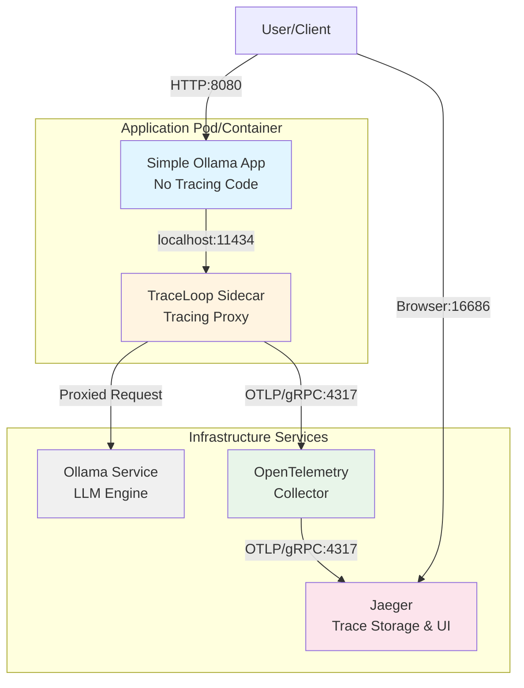
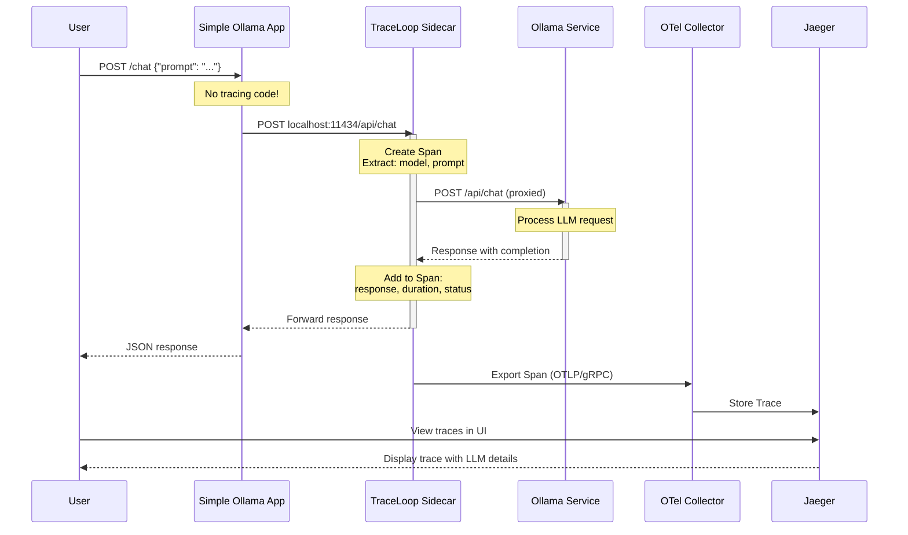
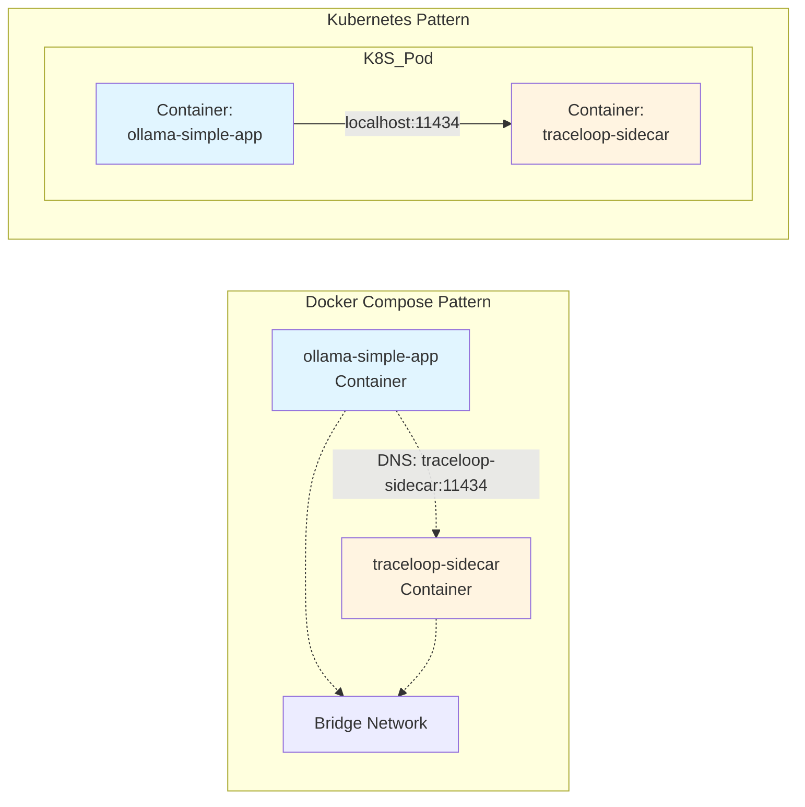
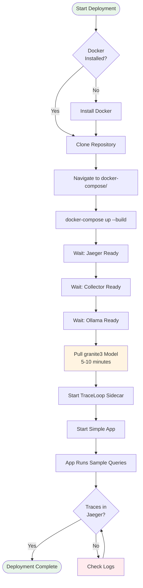
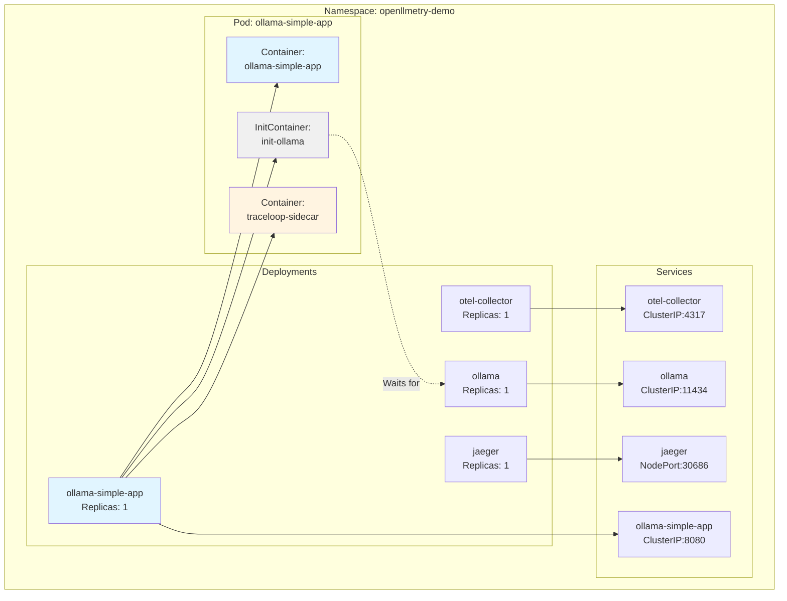
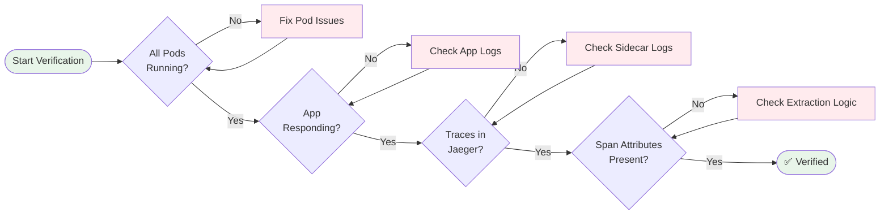

# Deployment Guide

Complete deployment guide for the OpenLLMetry SideCar project with step-by-step instructions for Docker Compose and Kubernetes environments.

## Table of Contents

- [Architecture Overview](#architecture-overview)
- [Prerequisites](#prerequisites)
- [Docker Compose Deployment](#docker-compose-deployment)
- [Kubernetes Deployment](#kubernetes-deployment)
- [Verification](#verification)
- [Troubleshooting](#troubleshooting)

---

## Architecture Overview

### System Architecture



### Request Flow with Tracing



### Deployment Patterns



---

## Prerequisites

### Common Requirements

- **Operating System**: Linux, macOS, or Windows with WSL2
- **Memory**: Minimum 4GB available RAM (6GB recommended)
- **Disk Space**: 5GB free space (for models and images)
- **Network**: Internet connection for downloading models

### Docker Compose Requirements

- Docker Engine 20.10+
- Docker Compose 2.0+

**Installation:**
```bash
# Verify Docker
docker --version
docker-compose --version

# Test Docker
docker run hello-world
```

### Kubernetes Requirements

- Minikube 1.30+ or any Kubernetes cluster
- kubectl 1.25+
- 6GB RAM minimum for Minikube

**Installation:**
```bash
# Verify Minikube
minikube version

# Verify kubectl
kubectl version --client

# Check available resources
free -h  # Linux/macOS
```

---

## Docker Compose Deployment

### Deployment Flow



### Step-by-Step Instructions

#### 1. Prepare Environment

```bash
# Clone the repository
git clone <repository-url>
cd OpenLLMetry-SideCar

# Navigate to docker-compose directory
cd docker-compose
```

#### 2. Start All Services

```bash
# Start all services (builds images automatically)
docker-compose up --build

# Or run in detached mode
docker-compose up --build -d
```

**What happens:**
1. Jaeger starts (trace backend)
2. OpenTelemetry Collector starts
3. Ollama starts and becomes healthy
4. Model puller downloads granite3:latest (~2GB, 5-10 minutes)
5. TraceLoop Sidecar starts
6. Simple Ollama App starts and runs sample queries

#### 3. Monitor Startup

```bash
# Watch all logs
docker-compose logs -f

# Watch specific service
docker-compose logs -f ollama-simple-app
docker-compose logs -f traceloop-sidecar
docker-compose logs -f ollama

# Check service status
docker-compose ps
```

**Expected output:**
```
NAME                    STATUS              PORTS
jaeger                  Up                  0.0.0.0:16686->16686/tcp
otel-collector          Up                  0.0.0.0:4317->4317/tcp
ollama                  Up (healthy)        0.0.0.0:11434->11434/tcp
traceloop-sidecar       Up                  0.0.0.0:11435->11434/tcp
ollama-simple-app       Up                  0.0.0.0:8080->8080/tcp
```

#### 4. Verify Deployment

```bash
# Test the application
curl -X POST http://localhost:8080/chat \
  -H "Content-Type: application/json" \
  -d '{"prompt": "What is OpenTelemetry?"}'

# Check health endpoint
curl http://localhost:8080/health
```

#### 5. Access Jaeger UI

Open browser: **http://localhost:16686**

1. Select service: **`ollama-simple-app`**
2. Click **"Find Traces"**
3. Click on any trace to see details
4. Inspect span attributes:
   - `llm.model`: granite3:latest
   - `llm.prompt`: User question
   - `llm.response`: Model answer
   - `http.response_time_ms`: Duration

#### 6. Stop Services

```bash
# Stop all services
docker-compose down

# Stop and remove volumes (including downloaded models)
docker-compose down -v
```

### Service Endpoints

| Service | Endpoint | Purpose |
|---------|----------|---------|
| Simple App | http://localhost:8080 | Application API |
| Jaeger UI | http://localhost:16686 | Trace visualization |
| Ollama | http://localhost:11434 | LLM API (direct) |
| Sidecar | http://localhost:11435 | Tracing proxy |
| Collector | http://localhost:4317 | OTLP gRPC |

---

## Kubernetes Deployment

### Deployment Flow

```mermaid
flowchart TD
    Start([Start K8s Deployment]) --> CheckMinikube{Minikube<br/>Installed?}
    CheckMinikube -->|No| InstallMinikube[Install Minikube]
    CheckMinikube -->|Yes| StartMinikube[minikube start<br/>--memory=6144 --cpus=4]
    InstallMinikube --> StartMinikube
    
    StartMinikube --> SetDockerEnv[eval $(minikube docker-env)]
    SetDockerEnv --> BuildImages[Build Container Images]
    
    BuildImages --> BuildSidecar[Build traceloop-sidecar]
    BuildSidecar --> BuildApp[Build ollama-simple-app]
    BuildApp --> BuildInstrumented[Build ollama-app]
    
    BuildInstrumented --> CreateNamespace[kubectl apply namespace]
    CreateNamespace --> DeployCollector[Deploy OTel Collector]
    DeployCollector --> DeployOllama[Deploy Ollama]
    DeployOllama --> DeployJaeger[Deploy Jaeger]
    DeployJaeger --> WaitReady[Wait for Pods Ready]
    
    WaitReady --> InitContainer[Init: Pull Model]
    InitContainer --> DeployApp[Deploy App + Sidecar Pod]
    
    DeployApp --> VerifyPods{All Pods<br/>Running?}
    VerifyPods -->|No| CheckLogs[Check Pod Logs]
    CheckLogs --> VerifyPods
    VerifyPods -->|Yes| AccessJaeger[Access Jaeger UI]
    
    AccessJaeger --> Success([Deployment Complete])
    
    style Start fill:#e8f5e9
    style Success fill:#e8f5e9
    style InitContainer fill:#fff4e1
    style CheckLogs fill:#ffebee
```

### Automated Deployment

#### Using Deploy Script

```bash
# Make script executable
chmod +x deploy-minikube.sh

# Run deployment
./deploy-minikube.sh
```

**Script performs:**
1. ✅ Checks prerequisites (minikube, kubectl)
2. ✅ Starts Minikube if not running
3. ✅ Sets Docker environment to Minikube
4. ✅ Builds all container images
5. ✅ Deploys all Kubernetes resources
6. ✅ Waits for pods to be ready
7. ✅ Displays access information

### Manual Deployment

#### 1. Start Minikube

```bash
# Start with sufficient resources
minikube start --memory=6144 --cpus=4

# Verify cluster
kubectl cluster-info
kubectl get nodes
```

#### 2. Configure Docker Environment

```bash
# Use Minikube's Docker daemon
eval $(minikube docker-env)

# Verify
docker ps
```

#### 3. Build Container Images

```bash
# Build TraceLoop Sidecar
cd traceloop-sidecar
docker build -t traceloop-sidecar:latest .
cd ..

# Build Simple Ollama App
cd ollama-simple-app
docker build -t ollama-simple-app:latest .
cd ..

# Build Instrumented App (optional)
cd ollama-app
docker build -t ollama-app:latest .
cd ..

# Verify images
docker images | grep -E "traceloop-sidecar|ollama-simple-app"
```

#### 4. Deploy Kubernetes Resources

```bash
# Deploy in order
kubectl apply -f k8s/00-namespace.yaml
kubectl apply -f k8s/01-otel-collector.yaml
kubectl apply -f k8s/02-ollama.yaml
kubectl apply -f k8s/04-jaeger.yaml
kubectl apply -f k8s/05-ollama-simple-app.yaml

# Or deploy all at once
kubectl apply -f k8s/
```

#### 5. Monitor Deployment

```bash
# Watch pod status
kubectl get pods -n openllmetry-demo -w

# Check specific pod
kubectl describe pod -n openllmetry-demo -l app=ollama-simple-app

# View logs
kubectl logs -n openllmetry-demo -l app=ollama-simple-app -c ollama-simple-app -f
kubectl logs -n openllmetry-demo -l app=ollama-simple-app -c traceloop-sidecar -f
```

**Expected pod status:**
```
NAME                                READY   STATUS    RESTARTS   AGE
otel-collector-xxx                  1/1     Running   0          2m
ollama-xxx                          1/1     Running   0          2m
jaeger-xxx                          1/1     Running   0          2m
ollama-simple-app-xxx               2/2     Running   0          1m
```

#### 6. Access Jaeger UI

**Method 1: NodePort**
```bash
# Get Minikube IP
minikube ip

# Access at: http://<minikube-ip>:30686
```

**Method 2: Port Forward**
```bash
# Forward Jaeger port
kubectl port-forward -n openllmetry-demo svc/jaeger 16686:16686

# Access at: http://localhost:16686
```

#### 7. Test Application

```bash
# Get service URL
minikube service -n openllmetry-demo ollama-simple-app --url

# Or port-forward
kubectl port-forward -n openllmetry-demo svc/ollama-simple-app 8080:8080

# Test API
curl -X POST http://localhost:8080/chat \
  -H "Content-Type: application/json" \
  -d '{"prompt": "Explain Kubernetes"}'
```

### Kubernetes Resources



### Cleanup

```bash
# Using cleanup script
./cleanup-minikube.sh

# Or manually
kubectl delete namespace openllmetry-demo

# Stop Minikube
minikube stop

# Delete Minikube cluster
minikube delete
```

---

## Verification

### Verification Checklist



### 1. Service Health Checks

**Docker Compose:**
```bash
# Check all services
docker-compose ps

# Health check endpoints
curl http://localhost:8080/health          # App
curl http://localhost:11434/api/tags       # Ollama
curl http://localhost:16686/api/services   # Jaeger
```

**Kubernetes:**
```bash
# Check pod status
kubectl get pods -n openllmetry-demo

# Check pod health
kubectl get pods -n openllmetry-demo -o wide

# Describe pod for events
kubectl describe pod -n openllmetry-demo <pod-name>
```

### 2. Application Testing

```bash
# Single chat request
curl -X POST http://localhost:8080/chat \
  -H "Content-Type: application/json" \
  -d '{"prompt": "What is distributed tracing?"}'

# Batch requests
curl -X POST http://localhost:8080/batch \
  -H "Content-Type: application/json" \
  -d '{"prompts": ["Question 1", "Question 2", "Question 3"]}'

# Expected response
{
  "response": "Distributed tracing is...",
  "model": "granite3:latest"
}
```

### 3. Trace Verification

**In Jaeger UI (http://localhost:16686):**

1. **Select Service**: `ollama-simple-app`
2. **Find Traces**: Click button
3. **Verify Trace Count**: Should see traces for each request
4. **Click Trace**: Inspect details

**Expected Span Attributes:**
- ✅ `llm.system`: ollama
- ✅ `llm.model`: granite3:latest
- ✅ `llm.operation`: chat
- ✅ `llm.prompt`: User's question
- ✅ `llm.response`: Model's answer
- ✅ `http.status_code`: 200
- ✅ `http.response_time_ms`: Duration in ms
- ✅ `service.name`: ollama-simple-app

### 4. Log Verification

**Docker Compose:**
```bash
# Application logs (should show NO tracing code)
docker-compose logs ollama-simple-app | grep -i "trace\|span\|otel"
# Should return nothing!

# Sidecar logs (should show tracing activity)
docker-compose logs traceloop-sidecar | grep -i "span\|trace"
# Should show span creation and export

# Collector logs
docker-compose logs otel-collector | grep -i "trace"
```

**Kubernetes:**
```bash
# Application logs
kubectl logs -n openllmetry-demo -l app=ollama-simple-app -c ollama-simple-app

# Sidecar logs
kubectl logs -n openllmetry-demo -l app=ollama-simple-app -c traceloop-sidecar

# Collector logs
kubectl logs -n openllmetry-demo -l app=otel-collector
```

---

## Troubleshooting

### Common Issues and Solutions

#### Issue 1: No Traces in Jaeger

**Symptoms:**
- Jaeger UI shows no traces
- Service not appearing in dropdown

**Diagnosis:**
```bash
# Check sidecar is running
docker-compose ps traceloop-sidecar  # Docker Compose
kubectl get pods -n openllmetry-demo  # Kubernetes

# Check sidecar logs
docker-compose logs traceloop-sidecar
kubectl logs -n openllmetry-demo -l app=ollama-simple-app -c traceloop-sidecar

# Verify app configuration
docker-compose exec ollama-simple-app env | grep OLLAMA_HOST
kubectl exec -n openllmetry-demo deployment/ollama-simple-app -c ollama-simple-app -- env | grep OLLAMA_HOST
```

**Solutions:**
1. Ensure `OLLAMA_HOST` points to sidecar (localhost:11434 or traceloop-sidecar:11434)
2. Check sidecar can reach collector:
   ```bash
   docker-compose exec traceloop-sidecar curl -v http://otel-collector:4317
   kubectl exec -n openllmetry-demo -l app=ollama-simple-app -c traceloop-sidecar -- curl -v http://otel-collector:4317
   ```
3. Restart sidecar:
   ```bash
   docker-compose restart traceloop-sidecar
   kubectl rollout restart deployment/ollama-simple-app -n openllmetry-demo
   ```

#### Issue 2: Model Not Found

**Symptoms:**
- Error: "model 'granite3:latest' not found"
- Application fails to start

**Diagnosis:**
```bash
# Check model status
docker-compose exec ollama ollama list
kubectl exec -n openllmetry-demo deployment/ollama -- ollama list
```

**Solutions:**
```bash
# Pull model manually (Docker Compose)
docker-compose exec ollama ollama pull granite3:latest

# Pull model manually (Kubernetes)
kubectl exec -n openllmetry-demo deployment/ollama -- ollama pull granite3:latest

# Wait for pull to complete (5-10 minutes)
# Then restart application
docker-compose restart ollama-simple-app
kubectl rollout restart deployment/ollama-simple-app -n openllmetry-demo
```

#### Issue 3: High Latency

**Symptoms:**
- Requests taking longer than expected
- Timeouts

**Diagnosis:**
```bash
# Check resource usage
docker stats  # Docker Compose
kubectl top pods -n openllmetry-demo  # Kubernetes

# Check Ollama logs
docker-compose logs ollama
kubectl logs -n openllmetry-demo deployment/ollama
```

**Solutions:**
1. Increase Ollama resources:
   ```yaml
   # docker-compose.yaml
   ollama:
     deploy:
       resources:
         limits:
           memory: 4G
           cpus: '2'
   
   # k8s/02-ollama.yaml
   resources:
     limits:
       memory: "4Gi"
       cpu: "2000m"
   ```

2. Check model is loaded:
   ```bash
   docker-compose exec ollama ollama ps
   ```

#### Issue 4: Pods Not Starting (Kubernetes)

**Symptoms:**
- Pods stuck in Pending or CrashLoopBackOff
- ImagePullBackOff errors

**Diagnosis:**
```bash
# Check pod status
kubectl get pods -n openllmetry-demo

# Describe pod for events
kubectl describe pod -n openllmetry-demo <pod-name>

# Check events
kubectl get events -n openllmetry-demo --sort-by='.lastTimestamp'
```

**Solutions:**

**For ImagePullBackOff:**
```bash
# Verify images exist in Minikube
eval $(minikube docker-env)
docker images | grep -E "traceloop-sidecar|ollama-simple-app"

# Rebuild if missing
cd traceloop-sidecar && docker build -t traceloop-sidecar:latest . && cd ..
cd ollama-simple-app && docker build -t ollama-simple-app:latest . && cd ..
```

**For Insufficient Resources:**
```bash
# Check Minikube resources
minikube status

# Restart with more resources
minikube stop
minikube start --memory=8192 --cpus=4
```

**For Init Container Failures:**
```bash
# Check init container logs
kubectl logs -n openllmetry-demo <pod-name> -c init-ollama

# Manually verify Ollama is ready
kubectl exec -n openllmetry-demo deployment/ollama -- curl http://localhost:11434/api/tags
```

#### Issue 5: Network Connectivity Issues

**Symptoms:**
- Services can't reach each other
- Connection refused errors

**Diagnosis:**
```bash
# Docker Compose: Check network
docker network ls
docker network inspect docker-compose_openllmetry-network

# Kubernetes: Check services
kubectl get svc -n openllmetry-demo
kubectl get endpoints -n openllmetry-demo

# Test connectivity
docker-compose exec ollama-simple-app curl http://traceloop-sidecar:11434/api/tags
kubectl exec -n openllmetry-demo deployment/ollama-simple-app -c ollama-simple-app -- curl http://localhost:11434/api/tags
```

**Solutions:**
1. Verify service names in configuration
2. Check network policies (Kubernetes)
3. Restart networking:
   ```bash
   # Docker Compose
   docker-compose down
   docker-compose up
   
   # Kubernetes
   kubectl delete pod -n openllmetry-demo --all
   ```

### Debug Commands Reference

**Docker Compose:**
```bash
# View all logs
docker-compose logs -f

# View specific service logs
docker-compose logs -f <service-name>

# Execute command in container
docker-compose exec <service-name> <command>

# Check service status
docker-compose ps

# Restart service
docker-compose restart <service-name>

# Rebuild and restart
docker-compose up --build -d <service-name>
```

**Kubernetes:**
```bash
# View pod logs
kubectl logs -n openllmetry-demo <pod-name> -c <container-name> -f

# Execute command in pod
kubectl exec -n openllmetry-demo <pod-name> -c <container-name> -- <command>

# Describe resource
kubectl describe <resource-type> -n openllmetry-demo <resource-name>

# Get events
kubectl get events -n openllmetry-demo --sort-by='.lastTimestamp'

# Port forward
kubectl port-forward -n openllmetry-demo <pod-name> <local-port>:<pod-port>

# Restart deployment
kubectl rollout restart deployment/<deployment-name> -n openllmetry-demo
```

---

## Next Steps

After successful deployment:

1. **Explore Traces**: Navigate through Jaeger UI to understand trace structure
2. **Test Different Prompts**: Send various requests to see different trace patterns
3. **Monitor Performance**: Use Jaeger to identify slow operations
4. **Customize Sidecar**: Modify [`traceloop-sidecar/proxy.py`](traceloop-sidecar/proxy.py) to add custom attributes
5. **Add to Your App**: Follow patterns in [`k8s/05-ollama-simple-app.yaml`](k8s/05-ollama-simple-app.yaml) to add sidecar to your applications

## Additional Resources

- [README.md](README.md) - Project overview and features
- [QUICKSTART.md](QUICKSTART.md) - 5-minute quick start guide
- [ARCHITECTURE.md](ARCHITECTURE.md) - Detailed architecture documentation
- [OpenTelemetry Documentation](https://opentelemetry.io/docs/)
- [Jaeger Documentation](https://www.jaegertracing.io/docs/)
- [Ollama Documentation](https://github.com/ollama/ollama)