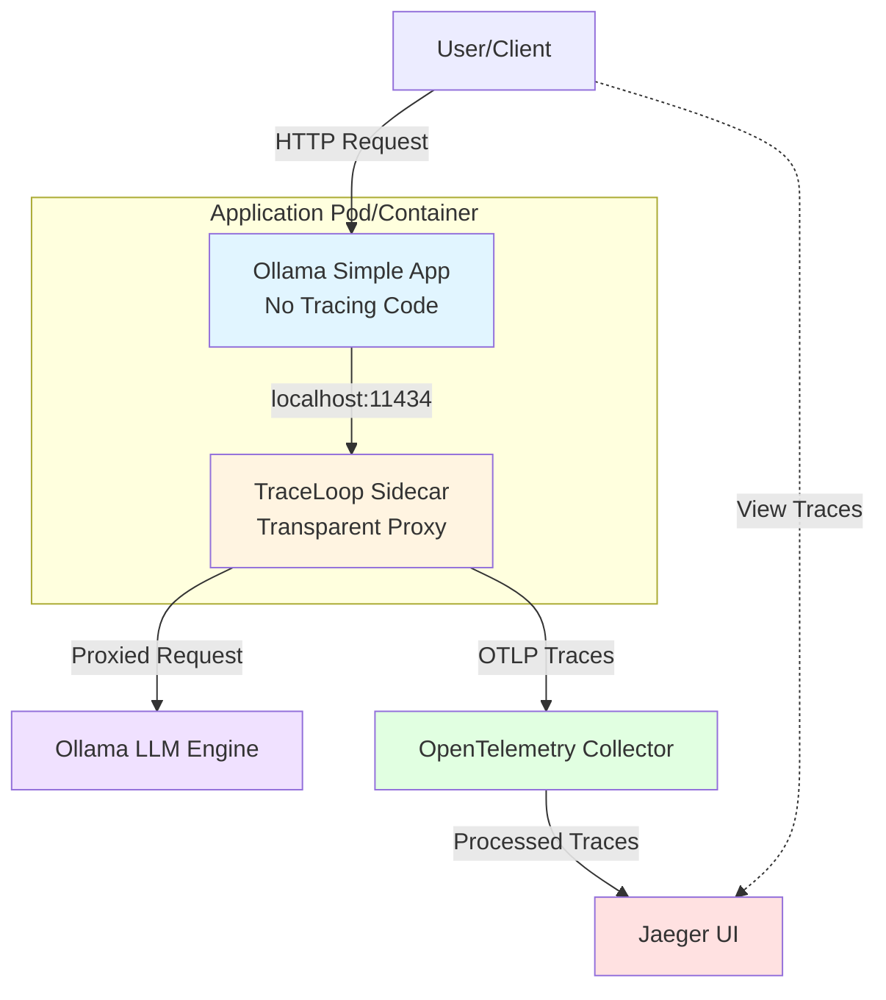
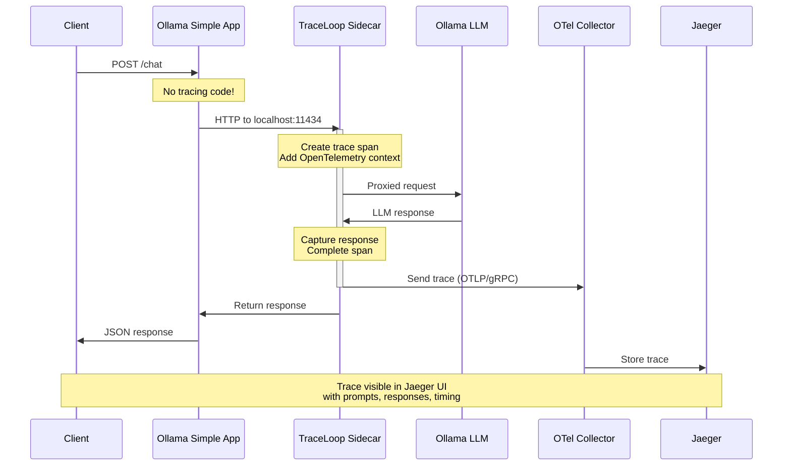
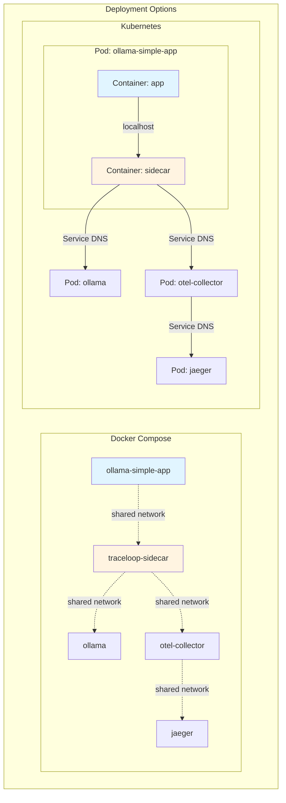
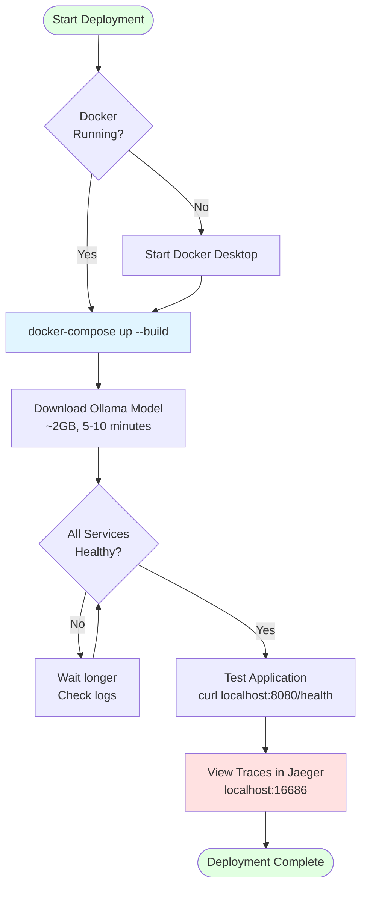
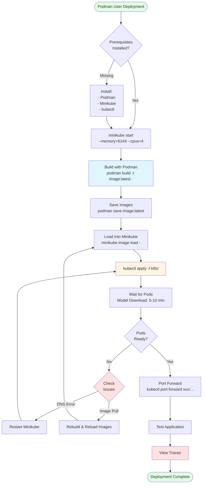

# Architecture and Deployment Diagrams

This document contains all mermaid diagrams for the OpenLLMetry SideCar project, providing visual representations of the architecture, data flow, and deployment processes.

## Table of Contents

1. [System Architecture](#system-architecture)
2. [Request Flow](#request-flow)
3. [Deployment Architecture](#deployment-architecture)
4. [Kubernetes Deployment Flow](#kubernetes-deployment-flow)
5. [Docker Compose Deployment Flow](#docker-compose-deployment-flow)
6. [Podman Deployment Flow](#podman-deployment-flow)

---

## System Architecture

High-level overview of the sidecar pattern implementation:



**Key Points:**
- Application has **zero tracing code**
- Sidecar intercepts all Ollama API calls
- Traces flow through OpenTelemetry Collector to Jaeger
- Complete separation of concerns

---

## Request Flow

Detailed sequence of a traced LLM request:



**Flow Steps:**
1. Client sends chat request to application
2. Application forwards to sidecar (thinks it's Ollama)
3. Sidecar creates trace span and proxies to real Ollama
4. Sidecar captures response and sends trace to collector
5. Collector processes and forwards to Jaeger
6. Trace appears in Jaeger UI with full context

---

## Deployment Architecture

Component relationships in both deployment modes:



**Key Differences:**
- **Docker Compose**: Separate containers on shared network
- **Kubernetes**: Sidecar pattern with containers in same pod sharing localhost

---

## Kubernetes Deployment Flow

Complete deployment process for Kubernetes:

```mermaid
flowchart TD
    Start([Start Deployment]) --> CheckMini{Minikube<br/>Running?}
    CheckMini -->|No| StartMini[minikube start<br/>--memory=6144 --cpus=4]
    CheckMini -->|Yes| BuildImages
    StartMini --> BuildImages
    
    BuildImages[Build Container Images<br/>docker/podman build] --> LoadImages{Using<br/>Podman?}
    
    LoadImages -->|Yes| SaveLoad[podman save | minikube image load]
    LoadImages -->|No| DirectBuild[Use Minikube Docker<br/>eval $(minikube docker-env)]
    
    SaveLoad --> Deploy
    DirectBuild --> Deploy
    
    Deploy[kubectl apply -f k8s/] --> WaitPods[Wait for Pods Ready<br/>5-10 minutes for model download]
    
    WaitPods --> CheckStatus{All Pods<br/>Running?}
    CheckStatus -->|No| WaitMore[Wait longer<br/>Check logs]
    WaitMore --> CheckStatus
    CheckStatus -->|Yes| PortForward
    
    PortForward[Port Forward Services<br/>kubectl port-forward] --> Test[Test Application<br/>curl localhost:8080/health]
    
    Test --> ViewTraces[View Traces in Jaeger<br/>localhost:16686]
    ViewTraces --> End([Deployment Complete])
    
    style Start fill:#e1ffe1
    style End fill:#e1ffe1
    style BuildImages fill:#e1f5ff
    style Deploy fill:#fff4e1
    style ViewTraces fill:#ffe1e1
```

**Automated Script:**
```bash
./deploy-podman.sh  # For Podman users
# OR
./start-all.sh      # Interactive menu
```

---

## Docker Compose Deployment Flow

Simplified deployment for Docker users:



**Quick Commands:**
```bash
./start-all.sh      # Interactive deployment
# OR
cd docker-compose && docker-compose up --build
```

---

## Podman Deployment Flow

Specialized flow for Podman users (Kubernetes required):



**Automated Script (Recommended):**
```bash
./deploy-podman.sh
```

**Manual Commands:**
```bash
# 1. Start Minikube
minikube start --memory=6144 --cpus=4

# 2. Build images
cd traceloop-sidecar && podman build -t traceloop-sidecar:latest . && cd ..
cd ollama-simple-app && podman build -t ollama-simple-app:latest . && cd ..

# 3. Load into Minikube
podman save traceloop-sidecar:latest | minikube image load -
podman save ollama-simple-app:latest | minikube image load -

# 4. Deploy
kubectl apply -f k8s/

# 5. Check status
./check-status.sh
```

---

## Common Issues and Solutions

### Minikube DNS Timeout
**Symptom:** `dial tcp: lookup registry-1.docker.io... i/o timeout`

**Solution:**
```bash
minikube stop
minikube start --memory=6144 --cpus=4
# Then build locally and load images
```

### Podman + Docker Compose Conflict
**Symptom:** `Cannot connect to Docker daemon`

**Solution:** Use Kubernetes deployment instead:
```bash
./deploy-podman.sh
```

### Image Pull Errors
**Symptom:** `ImagePullBackOff` or `ErrImagePull`

**Solution:**
```bash
# Rebuild and reload images
podman build -t image:latest .
podman save image:latest | minikube image load -
kubectl rollout restart deployment/name -n openllmetry-demo
```

---

## Related Documentation

- **[DEPLOYMENT.md](DEPLOYMENT.md)** - Complete deployment guide
- **[PODMAN-USERS.md](PODMAN-USERS.md)** - Podman-specific instructions
- **[ARCHITECTURE.md](ARCHITECTURE.md)** - Detailed architecture documentation
- **[TROUBLESHOOTING.md](TROUBLESHOOTING.md)** - Common issues and solutions
- **[QUICK-REFERENCE.md](QUICK-REFERENCE.md)** - Quick commands and URLs

---

## Utility Scripts

All deployment flows can be simplified using these scripts:

| Script | Purpose | Best For |
|--------|---------|----------|
| `./deploy-podman.sh` | Automated Podman deployment | Podman users |
| `./start-all.sh` | Interactive deployment menu | All users |
| `./check-status.sh` | Check deployment status | Monitoring |
| `./view-logs.sh` | View and manage logs | Debugging |
| `./stop-all.sh` | Stop services | Cleanup |

---

**Last Updated:** 2026-01-02